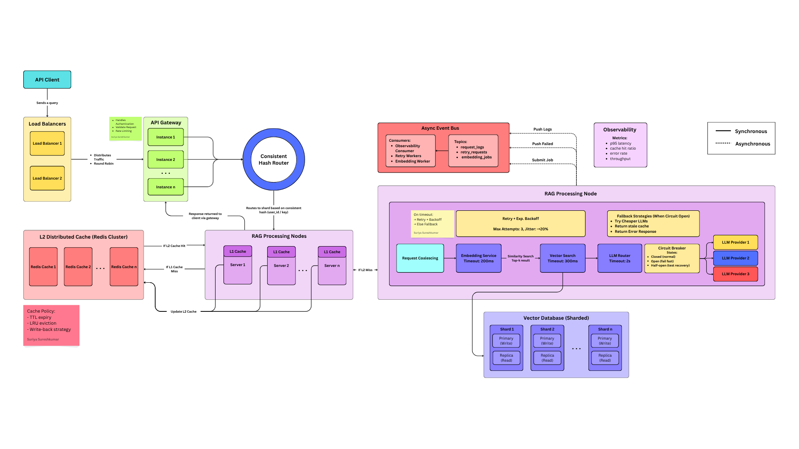

# Distributed RAG Inference System

> This repository contains a distributed Retrieval-Augmented Generation (RAG) inference system implemented in Rust.

## Architecture Overview

> Still in development.